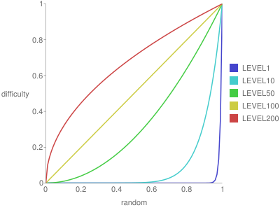

## Level-based Difficulty Setting

Until now, the discussion has primarily centered around games without a concept of levels (stages, rounds). However, when considering a game composed of multiple levels, each with its own difficulty setting, what types of difficulty configurations can be considered?

It's essential for the game to gradually become more challenging as the levels progress; otherwise, it may lack excitement. Yet, a mere linear increase in difficulty can result in a lack of variation. How can a level design be devised that becomes increasingly challenging with a fair amount of fluctuation? As an example, the method using the following graph is demonstrated.



The horizontal axis represents a value obtained from a `random` function that returns a random value between 0 and 1. The vertical axis represents difficulty, where 0 is the easiest, and 1 is the most challenging. Before starting a level, a value is obtained from the `random` function and set as the horizontal axis value, with the corresponding difficulty assigned as that level’s difficulty level.

The difficulty on this graph is calculated using the formula:

```
pow(random(), 100 / ([current level number] + 1))
```

In the early levels, when the number of levels is low, the difficulty tends to stick to the lower end, and as the number of levels increases, it expands upwards. Therefore, higher levels are likely to have higher difficulty settings, although occasionally, due to the return value of the `random` function, a level might be significantly easier or harder than its level number might suggest.

This difficulty can also be applied to multiple parameters, for example:

- Number of enemies
- Frequency at which enemies shoot
- Speed of bullets

By applying the above formula to set the difficulty for each of these parameters using the random function, more complex variations can be achieved. In some levels, there might be many enemies, but they don’t shoot very often, or there might be just one enemy, but it shoots very fast bullets, and so on.

In the later levels of the game, all parameters tend to stick to difficulty 1, resulting in a succession of generally challenging levels. However, since the difficulty itself is capped at 1, this setup allows for certain constraints as compared to merely increasing the difficulty linearly.

There are drawbacks to this method. Eventually, all parameters will stick to difficulty 1, making it impossible to create infinitely challenging levels. Setting the appropriate difficulty level in the state where it caps at 1 is challenging.

Even when employing other methods, it's crucial to ensure the difficulty increase is not monotonous. By varying the tension experienced by the player, a more enjoyable game progression can be achieved.
