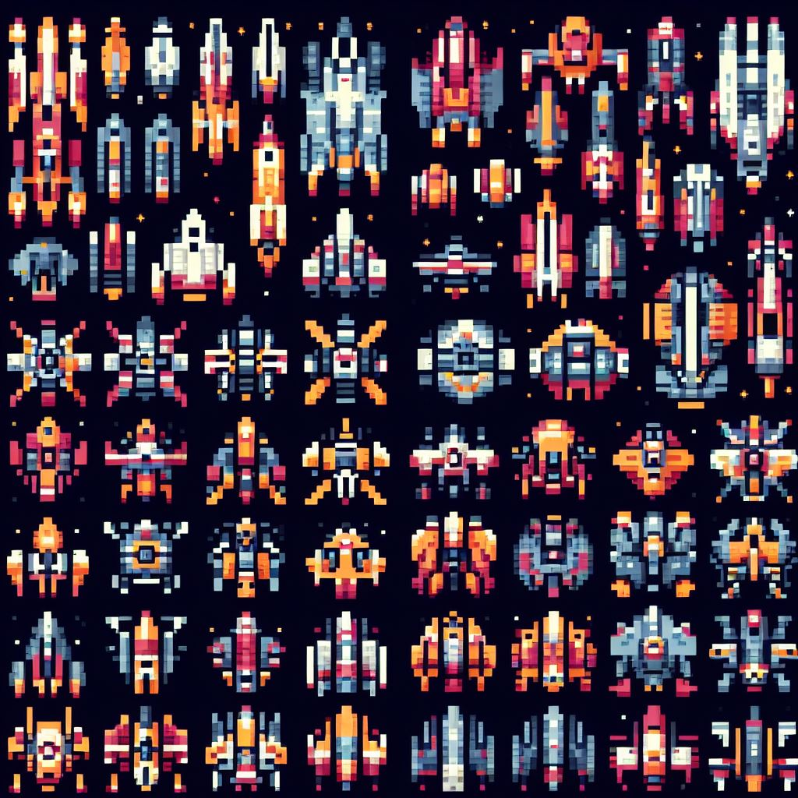

## Automatic Pixel Art Generation

Various types of tools referred to as automatic pixel art generators exist, with a common approach being to combine a multitude of predetermined parts and alter their colors to create new pixel art.[^1] This method is often employed in game avatar creation, allowing for the generation of a multitude of characters and their animations with consistency. However, this approach only allows for the creation of specific character variations. If a generator matching the desired character is not available, obtaining the desired pixel art becomes impossible.

A slightly more flexible approach involves adding dots that are randomly turned on/off to a base pixel art and through these changes, various patterns are created.[^2] With this method, by altering the base pixel art, it is possible to accommodate the generation of various characters.

I have also crafted a pixel art creation library following the method of random dot alteration.[^3] For instance, creating various shapes of spaceships using this library results in the following (click on the image to go to the demo page).

The products of this method are highly randomized, excelling at creating free-form characters like spaceships. However, they struggle with characters with constraints like monsters viewed from the side with distinct eyes, arms, and legs. Therefore, pixel art generators come with inherent strengths and weaknesses, with no one-size-fits-all solution available.

Recently, generative AI has enabled the creation of images based on prompts, and methods have emerged to apply this to pixel art.[^4] However, generative AI tends to excel at creating larger images, and is not well-suited for creating small images like those of 16x16 pixels.

Yet, with the advancement of technology, it might become possible to generate small images like pixel art, as well as their animations. For instance, by providing the following prompt to the Bing Image Creator,[^5] which is equipped with the DALL-E 3 model, one can obtain pixel art of spaceships that can be used in a shooting game:

> Create an image showcasing a collection of retro video game-style spaceships, viewed from above. Each spaceship should be designed within a 32x32 pixel grid, utilizing a 16-color palette. Arrange several of these pixelated spaceships in a visually appealing manner.

The instruction to create images within a 32x32 pixel grid as per the prompt has not yet been accurately followed. However, issues such as these are likely to be gradually resolved with the development of future generative models.

---

[^1]: [pixeldudesmaker](https://0x72.itch.io/pixeldudesmaker)
[^2]: [Pixel Spaceships](http://web.archive.org/web/20080228054410/http://www.davebollinger.com/works/pixelspaceships/)
[^3]: [pixel-art-gen](https://github.com/abagames/pixel-art-gen)
[^4]: [5 Best AI Pixel Art Generators in 2023](https://mspoweruser.com/ai-pixel-art-generator/)
[^5]: [Bing Image Creator](https://www.bing.com/create)
